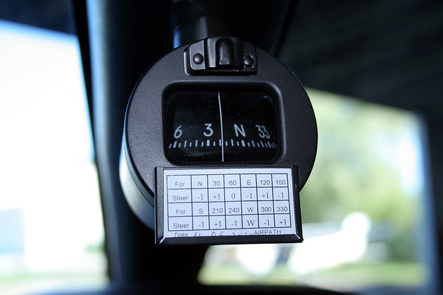
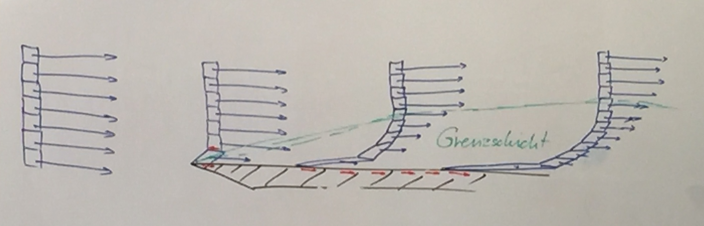

Unterrichtstag 10 - 13.12.2014
=============================

Navigation
----------
Faustformeln:

* NM = KM / 2 +10%
* KM = NM * 2 -10%
* Eine Fingerbreite = 2 Bogenminuten auf der ICAO Karte

TT - True Track
~~~~~~~~~~~~~~~
geflogene Strecke

TC - True Course
~~~~~~~~~~~~~~~~
mit Navigationskarte geplanter Flugkurs

TH - True Heading
~~~~~~~~~~~~~~~~~
True Course mit Wind Korrektur (Wind Correction Angle = WCA)

MC / MH - Magnetic Course / Heading
~~~~~~~~~~~~~~~~~~~~~~~~~~~~~~~~~~~
True Course / True Heading mit Korrektur der Variation

CH - Compass Heading
~~~~~~~~~~~~~~~~~~~~~~~~~~~~~~~~~~~
True Heading mit Korrektur von Variation und Deviation

WCA - Wind Correction Angle
~~~~~~~~~~~~~~~~~~~~~~~~~~~
Benötigte Kurskorrektur um bei entsprechendem Wind den True Course zu halten = True Heading

Variation
~~~~~~~~~
Abweichtung des magnetischen Nordpols vom Kartennord.

Ist am unteren Rand der ICAO Karte ablesbar. Für LSZI derzeit 1°30" E.
Jährliche Veränderung +11" / Jahr.

* Variation E (east) = muss vom TC substrahiert werden
* Variation W (west) = muss dem TC addiert werden

Beispiel 1:

* TC = 360°
* Var = 1.5° E
* **= Magnetic Course 358.5°**

Beispiel 2:

* TC = 360°
* Var = 7° W
* *= MC 7°*
* \+ 5° Wind Correction
* **= MH 12°**

Beispiel 3:

* TC = 090°
* WCA = +10°
* *= TH 190°*
* Var = 10° E
* **= MH 075°**

* Alle Angaben via Navigationskarte sind True (True Course / True Heading)
* Nach magnetischer Korrektur sind alle Werte *Magetic* (Magnetic Course / Magnetic Heading)

Deviation
~~~~~~~~~

Ungenaugikeit des Kompass durch elektrische Magnetfelder im Flugzeug (zb. Funkgeräte)
Die Abweichungen werden vom Techniker festgestellt und sind in einer Tabelle unter dem Kompass aufgezeichnet.

..[1] Quelle: `Define Aviation <http://www.defineaviation.info/magnetic-compass-and-timed-turns/>`_

Beispiel: Berechnung des magnetic headings mit Berücksichtigung der Deviation:

* TC = 180°
* WCA = +10°
* *= TH 190°*
* Var 5W = +5°
* *= MH 195°*
* Dev 5W = +5°
* **= CH 200°**

=====   ==========   ========
Karte   magnetisch   Kompass
        \+/- VAR     \+/- DEV
=====   ==========   ========
TC         MC          CC

TT         MT

TH         MH          CH

=====   ==========   ======== 

**VAR / DEV TC -> MC**

* x° E = TC - x°
* x° W = TC + x°

**MC -> TC**

* x° E = MC + x°
* x° W = MC - x°

Inklination
~~~~~~~~~~~

... ist der Winkel zwischen den erdmagnetischen Feldlinien und dem Horizont.

* nördlicher Kurs = Kompass hinkt nach
* südlicher Kurs = Kompass eilt voraus

Berechnung des Wind Correction Angle (WCA)
~~~~~~~~~~~~~~~~~~~~~~~~~~~~~~~~~~~~~~~~~~

* Windangaben beschreiben aus welcher Richtung der Wind weht. Zb. Wind aus 360° -> 180°
* Windpfeil: kleiner Strich 5KT, grosser Strich 10KT, Dreieck 50 KT
* Bodenwind: zb. vom Tower/ATIS ist bezogen auf Magnetisch Nord (mit Variation)
* Bodenwind: von der Wetterkarte ist bezogen auf True Nord (ohne Variation)
* Pistenangaben sind immer magnetisch Nord

Konstruktion des Winddreiecks [2]
~~~~~~~~~~~~~~~~~~~~~~~~~~~~~

1. Maßstab für die Geschwindigkeit festlegen (beispielsweise 10 kn = 1 cm, um die Konstruktion auf einem DIN-A4-Blatt zeichnen zu können)
#. TN festlegen (true north – rechtweisend Nord) oder geografisch Nord; wahre geografische Nordrichtung – stimmt mit N auf der Karte überein
#. TC einzeichnen (true course – rechtweisender Kartenkurs) auch rechtweisender Kurs (rwK) genannt: der Kurs, den das Flugzeug tatsächlich zurücklegt, der also auf der Karte eingezeichnet ist.
#. Hilfsmeridian in Kursrichtung einzeichnen
#. Wind-Vektor (Wind mit ursprünglicher Richtung) im Schnittpunkt Hilfsmeridian / TC mit Windgeschwindigkeit eintragen
#. Um den Anfangspunkt des Windvektors Kreisbogen mit TAS (true airspeed – wahre Eigengeschwindigkeit) auf TC schlagen
#. Schnittpunkt Kreisbogen / TC mit Anfangspunkt des Wind-Vektors verbinden (Steuerkurs-Vektor)
#. Auf TC (Kurs-über-Grund-Vektor) Grundgeschwindigkeit (VG) ausmessen, Maßstab berücksichtigen
#. WCA (wind correction angle – Windvorhaltewinkel) zwischen TC und TH messen

..[2] Quelle: `Wikipedia <http://de.wikipedia.org/wiki/Winddreieck>`_

Grundlagen des Fluges
----------

* **Druckpunkt**: Angriffspunkt von der Aerodynamischen Auftriebskraft an der Profilsehne

  * Der Druckpunkt wandert nach vorne je grösser der Anstellwinkel ist.
  * Ausnahme: symmetrische Profile

Die Grenzschicht
~~~~~~~~~~~~~~~~

* **Viskosität** ist der Widerstand gegen Deformationsgeschwindigkeit

  * Festkörper: Kraft is proportional zur Deformation (Elastizität)
  * Fluid: Kraft ist abhängig von Deformationsgeschwindigkeit (Viskosität)
* In der Grenzschicht herrscht erhöhte Reibung
* Ausserhab der Grenzschicht herrscht Reibungsfreie Strömung
* Die Grenzschicht wird mit zunehmender Strömungsgeschwindigkeit dichter

  * Es entstehen Turbulenzen (Verwirbelungen)
* Die Geschwindigkeit der turbulenten Grenzschicht ist **höher** als der laminaren Grenzschicht

  * Mehr kinetische Energie, Bessere Haftung am Profil
* Die turbulente Grenzschicht hat eine deutlich höhrere Dichte (verursacht durch Verwirbelungen)

  * dadurch entsteht erhöhter Widerstand / Reibung
* Je höher der Widerstand, desto höher werden die Temperaturen

  * deshalb gibt es Hitzeschilder für Space Shuttle für den Wiedereintritt in die Erdathmosphäre
* Laminarprofile erzeugen weniger Turbulenzen, dh. geringerer Widerstand
* Nieten und Mücken auf dem Profil erzeugen erhöhten Widerstand

  * deshalb können Segelflieger die Tragflächen während des Fluges reinigen
* Grenzschichtablösung führt zum Stall

Auftriebshilfen (Flaps / Slats)
~~~~~~~~~~~~~~~~~~~~~~~~~~~~~~~~~~~~~~~~~~~~~~~~

* Der erhöhte Auftrieb wird hauptsächlich auf der Flügelunterseite erzeugt

  * Ausnahmen: Fowler Flaps & Spaltklappen (marginal)
  * Fowler Flaps erzeugen den stärksten Auftrieb
* Vorflügel (Slats) sorgen für:

  * erhöhtem Auftrieb
  * höherer kritischer Anstellwinkel
* Druckpunkt wandert beim Ausfahren der Klappen nach hinten
* Das Ausfahren der Klappen bewirkt i.d.R. ein Nose-Up Moment, **Ballooning** genannt

  * zum Behalten des gleichen Antriebskoeffizienten, muss die Nase gesenkt werden
* Klappen sind filigran und haben eine maximal erlaubte Geschwindigkeit

  * Höchstgeschwindigkeit = Vfe (FE = FLaps extended)
  * Höchstgeschwindigkeit beim Ausfahren/Einfahren = Vfo (FO = Flaps Operation)
* Limitiertes Lastvielfaches (üblicherweise 2G) bei ausgefahrenen Klappen

Aerodynamische Bremsen (Spoiler / Speed Brakes)
~~~~~~~~~~~~~~~~~~~~~~~~~~~~~~~~~~~~~~~~~~~~~~~~~~~~~~~~~~~~~

* erhöhen den Luftwiderstand
* verringern den Auftrieb

Seitengleitflug (Glissade / Splip)
~~~~~~~~~~~~~~~~~~~~~~~~~~~~~~~~~~

* bedeutet überkreuzen von Seitenruder und Querruder
* führt zum schieben des Flugzeugs -> Rumpf erzeugt Widerstand
* ist mit ausgefahrenen Klappen meistens nicht erlaubt
* führt zu schnellem Sinken

Strömungsablösung (Stall)
~~~~~~~~~~~~~~~~~~~~~~~~~~~~~~~~~~~~~~~

* Querruder verlieren stark an Wirkung
* führt zu Schütteln / Taumeln
* erzeugt ein Nose-Down Moment am Höhenleitwerk
* Low Speed Stall

  * wenn Vs (Stall) oder Vs0 (Stall w/ flaps extended) erreicht ist
  * Lastvielfaches und Gewicht beeinflussen Vs/Vs0

