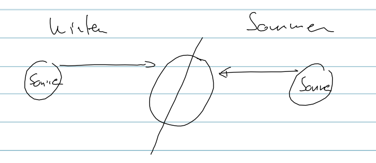

Unterrichtstag 2 - 18.10.2014
=============================

Navigation
----------
Sommerzeiten gibt es wegen dem 23.5° Winkel zur ????.

Null Meridian ist in London

Orthodrome sind die kürzesten Verbindungen auf der Oberfläche

Längengrade
~~~~~~~~~~~
// TODO: beschreiben

Breitengrade
~~~~~~~~~~~~
// TODO: beschreiben

Grundlagen des Fluges
---------------------
// TODO: was haben wir hier angeschaut?

Merken
------
* knots = nm/h
* Faustformel: km -> nm (km/2 = nm)
* Faustformel: ft -> m (ft/3 = m)
